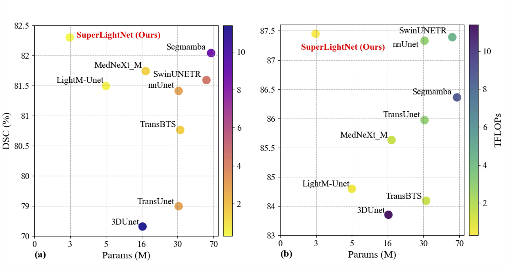

# [SuperLightNet](https://github.com/WTU-MIS-Laboratory/SuperLightNet)

(Hyperlinks will be updated at the appropriate time)

Official repository for "SuperLightNet: Lightweight Parameter Aggregation Network for Multimodal Brain Tumor Segmentation".


## Release

-  🔥**News**: ```2025/3/2```: SuperLightNet released.


## Introduction to SuperLightNet

SuperLightNet is an ultra-lightweight multimodal framework for brain tumor segmentation, employing a parameter-efficient architecture with only 2.97 million parameters. Compared to the state-of-the-art methods, our network demonstrates a leading reduction in parameter count by 95.59\% (2.97M), the 96.78\% improvement in computational efficiency (0.282 TFlops), the 96.86\% enhancement in memory access performance (45.8G), and an average performance gain of 0.21\% on the BraTS2019 and BraTS2021 datasets.




## Get Start

Requirements: `CUDA ≥ 11.8`

1. Create a virtual environment: `conda create -n superlightnet python=3.8 -y` and `conda activate superlightnet`
2. Install Pytorch ≥ 2.2, torchvision ≥ 0.17.0, torchaudio ≥ 2.2.0
3. MONAI == 1.3.0
4. Download code: `git clone https://github.com/WTU-MIS-Laboratory/SuperLightNet.git`

## Data Preprocess

Download BraTS2019 dataset [here](https://www.med.upenn.edu/cbica/brats-2019/) and BraTS2021 dataset [here](http://braintumorsegmentation.org/). Then unzip them into `datasets/processed`, and change the `'root'` path into your unzip path, 

```
train_set = {
        'root': 'MICCAI_BraTS_2019_Data_Training/Train',
        'file_list': 'train.txt',
        }
```


make sure the file tree of datasets as follow:


```
data/
├── processed/
│   ├── MICCAI_BraTS_2019_Data_Training/
│   │   ├── LGG
│   │   │   ├── BraTS19_TMC_30014_1
│   │   │   │	├── BraTS19_TMC_30014_1_t1.nii.gz
│   │   │   │	├── BraTS19_TMC_30014_1_t1cd.nii.gz
│   │   │   │	├── BraTS19_TMC_30014_1_t2.nii.gz
│   │   │   │	├── BraTS19_TMC_30014_1_flair.nii.gz
│   │   │   │	├── BraTS19_TMC_30014_1_seg.nii.gz
│   │   │   │	├── BraTS19_TMC_30014_1_pkl_ui8f32b0.pkl
│   │   │   ├── ...
│   │   ├── HGG
│   │   │   ├── ...
│   │   ├── cross_validation
│   │	│	├── t1.txt
│   │	│	├── t2.txt
│   │	│	├── ...
│   │	│	├── v1.txt
│   │	│	├── v2.txt
│   │	│	├── ...
│   ├── ...
```
